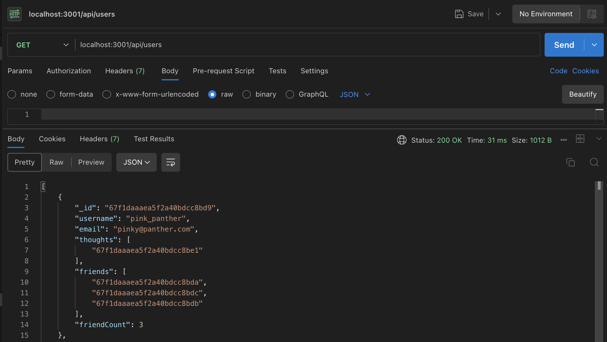

# Social Network - API


## Table of Contents

- [Description](#description)
- [Instructions](#instructions)
- [Demonstration](#demonstration)
- [Technologies](#technologies)
- [Contributions](#contributions)
- [Questions](#questions)


## Description
This project utilizes JavaScript and MongoDB to create an API from scratch that allows users to create an account, post thoughts, reactions, and keep track of friend lists! This challenge is used as a demo of the backend happenings of a social media website and meant to display an understanding of API endpoints and incorporating NoSQL into a JS project.


## Instructions

Within your CLI, you'll need to run the following command:

```bash
npm i; npm run build; npm run seed; npm start 
```

First you're installing the dependencies needed for this project, then you're compiling your TypeScript files into JavaScript. 
Next you'll be seeding the project with provided sample data. Finally running the start command to test the finished result. 

## Demonstration 
<br><br>



### GET

-GET routes to return all users and all thoughts.<br>
-GET routes to return a single user and a single thought by id. <br>
[Demo Video](https://drive.google.com/file/d/18mcWz8feD2mvZ71lh-NSs4r8sRUmY0IO/view)

### POST, PUT, DELETE

-POST, PUT, and DELETE routes for users. <br>
-POST, PUT, and DELETE routes for thoughts. <br>
[User Demo Video](https://drive.google.com/file/d/1PItudhV09Wsi0qrH6pG4vOQXHxPCwn_M/view)
[Thought Demo Video]()


### POST & DELETE

-POST and DELETE routes for a user's friend list. <br>
-POST and DELETE routes for reactions to thoughts. <br>
[POST & DELETE Demo]('#')


## Technologies
* JavaScript
* TypeScript
* NoSQL (MongoDB)

## Contributions
Boiler plate code used throughout Module 17, and XPert Learning Assistant

## Questions 
If you have any additional questions about the project, please feel free to raach me at: 
- GitHub [jaornelas](https://github.com/jaornelas)
- E-Mail [ornelalf001@gmail.com](mailto:ornelalf001@gmail.com)


